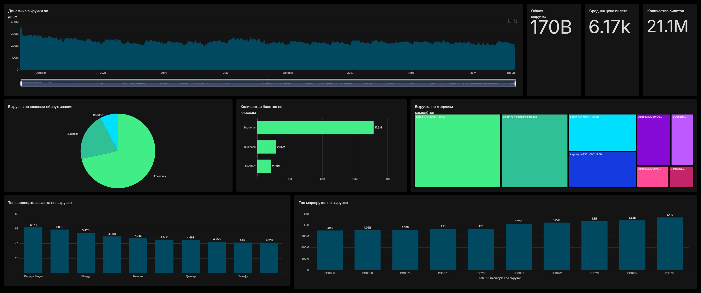

# ✈️ Airline DWH — учебное хранилище данных на PostgreSQL

Учебный проект для практического понимания того, как устроено хранилище данных:
слои, потоки загрузки, технические поля, имитация **CDC** и витрины для BI.
Всё реализовано на чистом PostgreSQL — DDL и хранимые процедуры (PL/pgSQL),
без внешних ETL-инструментов.

**Источник данных** — демонстрационная база PostgresPro «Авиаперевозки»
([postgrespro.ru/education/demodb](https://postgrespro.ru/education/demodb)):
бронирования, билеты, перелёты, рейсы, маршруты, аэропорты, самолёты, места,
посадочные талоны.

---

## 🧱 Стек

| Компонент | Назначение |
|---|---|
| **PostgreSQL 15+** | СУБД хранилища и источника |
| **PL/pgSQL** | вся логика ETL: процедуры и функции |
| **postgres_fdw** | подключение к БД-источнику `demo` |
| **Apache Superset** | BI-дашборд поверх витрин слоя DM |

---

## 🗺️ Архитектура слоёв

Данные движутся слева направо. Каждый слой решает свою задачу и не «перепрыгивает» соседа.


| Слой | Схема | Что хранит | Гранулярность / приём |
|---|---|---|---|
| **Источник** | `source_fdw` | внешние таблицы demo через FDW | read-only |
| **RAW** | `raw` | сырьё «как есть» + лог операций I/U/D | append-only, хеш строки |
| **STAGE** | `stg` | очищенные и провалидированные данные одного batch | `truncate` + `insert` |
| **ODS** | `ods` | **актуальное** состояние сущностей | `upsert` + soft-delete |
| **DDS** | `dds` | измерения (SCD1/SCD2) и факты со связями | `upsert` / историзация |
| **DM** | `dm` | готовые денормализованные витрины | инкремент / пересчёт |
| **meta** | `meta` | управление загрузкой и метаданные источника | — |

---

## ⚙️ Имитация CDC в RAW

В демобазе нет настоящего CDC (журнала изменений), поэтому изменения вычисляются
сравнением **снимка** (`*_snapshot`) с текущим состоянием источника по **хешу строки**.

Для каждой строки считается `raw_row_hash = md5(concat_ws('|', col1, col2, …))`.
Сравнение снимка и источника даёт три типа операций:

| Операция | Условие | Куда пишется |
|---|---|---|
| **I** (insert) | ключ есть в источнике, нет в снимке | новая строка в RAW |
| **U** (update) | ключ есть в обоих, но хеши разные | новая строка в RAW |
| **D** (delete) | ключ есть в снимке, нет в источнике | новая строка в RAW |

RAW при этом **никогда не обновляется** — это журнал событий: каждая операция
добавляется новой строкой с `operation_type` и `batch_id`. После расчёта дельты
снимок переписывается под актуальное состояние источника.

**Процедуры на каждую таблицу** (на примере `bookings`):

```
raw.load_bookings_initial()          -- первичная полная загрузка
raw.init_bookings_snapshot()         -- инициализация снимка (только если пуст)
raw.prepare_bookings_delta_source()  -- temp-таблица из источника с хешами
raw.insert_bookings_delta_i(batch)   -- поиск вставок
raw.insert_bookings_delta_u(batch)   -- поиск изменений
raw.insert_bookings_delta_d(batch)   -- поиск удалений
raw.refresh_bookings_snapshot()      -- обновление снимка
raw.load_bookings_delta()            -- оркестратор: вызывает всё по порядку
```

---

## 🔄 Перелив между слоями

| Переход | Алгоритм |
|---|---|
| **RAW → STAGE** | `truncate` STAGE, берётся последний `batch_id`, данные чистятся (`upper`, `trim`, разбор JSONB на `*_en` / `*_ru`) и проверяются процедурой валидации → проставляются `is_valid` и `validation_error`. |
| **STAGE → ODS** | `upsert` (`insert … on conflict do update`) для `I`/`U`; для `D` — мягкое удаление (`is_deleted = true`). ODS хранит ровно одну актуальную строку на ключ. |
| **ODS → DDS (измерения, SCD2)** | для `dim_airplanes`, `dim_airports`, `dim_routes`: закрытие изменившихся версий (`valid_to`, `is_current = false`) + вставка новых актуальных версий. Единственность активной версии гарантируется частичным уникальным индексом `where is_current = true`. |
| **ODS → DDS (измерения, SCD1)** | для `dim_seats`, `dim_passenger`: простой `upsert`, история не хранится. |
| **ODS → DDS (факты)** | `upsert` по натуральному ключу с подстановкой **суррогатных ключей** измерений через `join`. Для рейсов — темпоральное соединение с маршрутом: `scheduled_departure <@ validity AND is_current`. |
| **DDS → DM** | `flight_sales_mart` собирается денормализацией всех фактов и измерений; инкремент по `source_max_batch_id = greatest(всех batch_id источников)`. Производные витрины строятся уже из неё. |

### Оркестрация

```
meta.load_<entity>_pipeline()   -- по сущности: raw delta → stg → ods → dds
meta.load_data_mart_pipeline()  -- главный: все сущности + 3 DM-витрины
```

Порядок в главном пайплайне важен: сначала справочники (самолёты, аэропорты,
маршруты), затем факты (рейсы, бронирования, билеты, перелёты), и только потом
витрины — чтобы суррогатные ключи и связи уже существовали.

---

## 🏷️ Технические поля по слоям

Бизнес-колонки во всех слоях повторяют источник. Различаются **служебные поля** —
именно они дают аудит, lineage и историзацию.

**RAW** — журнал событий:
`load_date` · `record_source` · `source_system` · `batch_id` · `operation_type` (I/U/D) · `raw_row_hash`.
Снимок: `raw_row_hash` · `last_seen_at`.

**STAGE** — очистка и контроль качества:
`raw_load_date` · `stg_load_date` · `source_system` · `record_source` · `batch_id` · `operation_type` · `is_valid` · `validation_error`.

**ODS** — актуальное состояние:
`source_system` · `record_source` · `created_batch_id` · `updated_batch_id` · `last_changed_at` · `is_deleted` · `last_operation_type`.

**DDS — SCD2** (история версий):
`<entity>_sk` (суррогатный ключ) · `valid_from` · `valid_to` · `is_current` · `batch_id`.

**DDS — SCD1 / факты**:
`<entity>_sk` · ссылки на `*_sk` измерений · `batch_id` · `last_changed_at` · `is_deleted`.

**DM** — витрины:
`source_max_batch_id` (для инкремента) · `mart_load_date`.

---

## 🛠️ meta-слой

| Объект | Назначение |
|---|---|
| `meta.load_batch` | лог каждого запуска: `process_name`, `status` (RUNNING/SUCCESS/FAILED), время, ошибка |
| `meta.start_batch` / `finish_batch` / `fail_batch` | открытие, успешное закрытие и фиксация ошибки запуска |
| `meta.source_dictionary` | словарь таблиц и колонок источника с описаниями |
| `meta.source_constraints` / `source_indexes` | реестр ограничений (PK/FK/CHECK/UNIQUE/EXCLUDE) и индексов источника |

Каждая «сборочная» процедура оборачивает шаги в `start_batch` … `finish_batch`,
а в блоке `exception` вызывает `fail_batch` и пробрасывает ошибку. Длительность
шагов логируется через `clock_timestamp()` и `raise notice`.

---

## 📊 Витрины DM и BI

| Витрина | Гранулярность | Содержимое |
|---|---|---|
| `dm.flight_sales_mart` | сегмент билета (`ticket_no` + `flight_id`) | детальная денормализованная витрина продаж |
| `dm.flight_revenue_mart` | рейс (`flight_id`) | выручка и пассажиры по классам обслуживания |
| `dm.airport_traffic_daily` | день + аэропорт | пассажиропоток: вылеты и прилёты |

Для Superset создан отдельный пользователь `superset_user` с правами **только на чтение**
схемы `dm`, плюс индексы на `flight_sales_mart` для ускорения отчётов.

### Дашборд



Дашборд продаж: динамика выручки по дням, ключевые показатели (общая выручка,
средняя цена билета, количество билетов), выручка и количество билетов по классам
обслуживания, выручка по моделям самолётов, топ аэропортов вылета и топ маршрутов
по выручке.

---

## 📁 Структура репозитория

```
src/sql/
  00_init/    схемы, FDW, meta (лог, словарь, ограничения), доступ Superset
  01_raw/     таблицы RAW и snapshot, процедуры initial + delta (CDC)
  02_stage/   таблицы STAGE, очистка и валидация
  03_ods/     таблицы ODS, upsert + soft-delete
  04_dds/     измерения (SCD1/SCD2) и факты
  05_dm/      витрины и процедуры их загрузки
  create_etl_pipeline_procedures.sql   pipeline-процедуры по сущностям + главный
src/superset/screenshots/   скриншот дашборда
```

## 🚀 Порядок запуска

1. Поднять источник `demo` и накатить SQL-слои по порядку папок `00_init … 05_dm`.
2. Выполнить первичную загрузку (`*_initial`) и инициализировать снимки (`init_*_snapshot`).
3. Для регулярного обновления вызывать `call meta.load_data_mart_pipeline();`.
4. Подключить Superset к схеме `dm` под пользователем `superset_user`.
